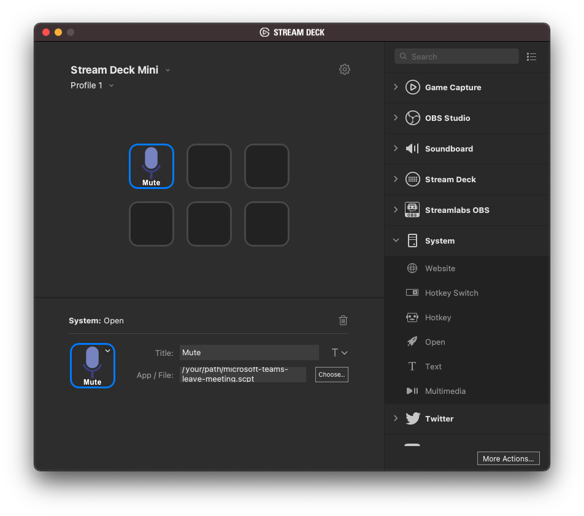
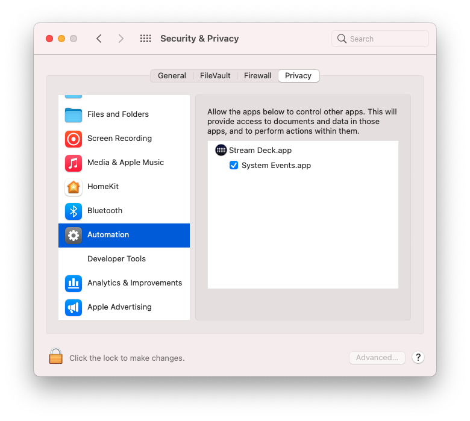

# This repository has been obsoleted by [Microsoft's native Teams plugin for the Elgato Stream Deck](https://techcommunity.microsoft.com/t5/healthcare-and-life-sciences/teams-plugin-for-elgato-stream-deck-re-released-also-run-with/ba-p/3767650). As such, this repository is being archived and no longer maintained. #

# Overview

This repository contains various AppleScripts that add pseudo global hotkey / shortcut support for Microsoft Teams. I use these scripts with an [Elgato Stream Deck](https://www.elgato.com/en/stream-deck) to toggle mute, toggle video, and leave a meeting anywhere in MacOS.

If/when Microsoft adds [global hotkey / shortcut support](https://microsoftteams.uservoice.com/forums/555103-public/suggestions/31690408-register-global-hotkey) to Teams, these AppleScripts will be unnecessary.

There are three AppleScripts included here bringing the following functionality to Microsoft Teams:
- Global mute toggle (Shift + ⌘ + M)
- Global video toggle (Shift + ⌘ + O)
- Global leave meeting (Shift + ⌘ + B)

I've commented each AppleScript thoroughly so it should easy to understand what each script is doing. Essentially, each script simply switches the focus to Microsoft Teams, sends the hotkey, and then switches back to the application that was in focus previously.

# Usage

The .applescript files are the plaintext AppleScripts and there are corresponding compiled .scpt versions for each script. You can execute either version but executing the compiled .scpt version is technically more performant.

The way in which I use these AppleScripts are via an Elgato Stream Deck. Using the Stream Deck, create a button with a System > Open action and set the 'App / File' field to the full path of the .scpt file. I've also included the icons I use for my buttons (see the icon-*.png files in this repository). Note that Stream Deck will need the `Automation` persmission under MacOS System Preferences > Security & Privacy > Automation. The first time you press the Stream Deck button MacOS should prompt you to grant this permission to Stream Deck.

# Notes

[Scott Hanselman wrote a blog post](https://www.hanselman.com/blog/microsoft-teams-buttons-for-stream-deck-to-mute-share-hang-up-and-manage-cameras) using a Stream Deck to issue Microsoft Teams hotkeys but it relies upon Teams being the active application. His blog post was the first I came across when I was searching for existing solutions.

[Greg Sheridan wrote a similar blog post](https://greiginsydney.com/make-microsoft-teams-shortcuts-global/) but it was specific to Windows whereas I was looking for a MacOS solution.

[Jesse Riddle wrote a MacOS specific blog post](https://medium.com/macoclock/how-in-the-bleep-do-i-mute-my-mic-anywhere-on-macos-d2fa1185b13) on muting your microphone anywhere in MacOS and is what sent me down the path of AppleScript. However, Jesse's post uses the MacOS Automator and the latest privacy and security controls in MacOS make this Automater untenable for this specific use case. Namely, every single MacOS application would need the `Automation` permission (aka `System Events`). The method I ultimately landed on requires just Stream Deck to have this permission.

# Contributions

I welcome any contributions via pull requests -- especially fixes for edge cases I have not accounted for.

# License

Copyright 2021 Kevin Shekleton

Licensed under the Apache License, Version 2.0 (the "License");
you may not use this file except in compliance with the License.
You may obtain a copy of the License at

    http://www.apache.org/licenses/LICENSE-2.0

Unless required by applicable law or agreed to in writing, software
distributed under the License is distributed on an "AS IS" BASIS,
WITHOUT WARRANTIES OR CONDITIONS OF ANY KIND, either express or implied.
See the License for the specific language governing permissions and
limitations under the License.
